# Domus Development Guidelines

Domus is a **public source** project - the code is publicly available for learning and inspiration. This document outlines the development standards and commit conventions used in the project.

## Conventional Commits

We use [Conventional Commits](https://www.conventionalcommits.org/) for all commit messages. This enables automated versioning and changelog generation.

### Commit Message Format

```
<type>[optional scope]: <description>

[optional body]

[optional footer(s)]
```

### Types

- **feat**: A new feature (triggers minor version bump)
- **fix**: A bug fix (triggers patch version bump)
- **perf**: A performance improvement (triggers patch version bump)
- **refactor**: A code change that neither fixes a bug nor adds a feature (triggers patch version bump)
- **docs**: Documentation only changes (no version bump)
- **style**: Changes that do not affect the meaning of the code (no version bump)
- **test**: Adding missing tests or correcting existing tests (no version bump)
- **build**: Changes that affect the build system or external dependencies (no version bump)
- **ci**: Changes to our CI configuration files and scripts (no version bump)
- **chore**: Other changes that don't modify src or test files (no version bump)
- **revert**: Reverts a previous commit (triggers patch version bump)

### Breaking Changes

For breaking changes, add `BREAKING CHANGE:` in the footer or add `!` after the type:

```
feat!: remove deprecated authentication method

BREAKING CHANGE: The old authentication method has been removed. 
Users must migrate to the new JWT-based authentication.
```

### Examples

```bash
# Features
feat: add task assignment to family members
feat(auth): implement OAuth2 integration
feat!: remove legacy API endpoints

# Bug fixes
fix: resolve user session timeout issue
fix(ui): correct mobile navigation overflow

# Performance
perf: optimize database queries for dashboard

# Refactoring
refactor: extract user validation logic

# Documentation
docs: update installation instructions
docs(api): add endpoint documentation

# Tests
test: add integration tests for authentication

# Chores
chore: update dependencies
chore(deps): bump rails to 8.0.3
```

## Development Workflow

### Complete Step-by-Step Guide: Feature → Develop → Main → Release

#### 1. **Start a New Feature**

```bash
# Switch to develop and pull latest changes
git checkout develop
git pull origin develop

# Create a new feature branch
git checkout -b feature/your-feature-name
```

**Branch naming conventions:**
- `feature/task-management` - New features
- `fix/authentication-bug` - Bug fixes  
- `refactor/user-service` - Code refactoring
- `docs/api-documentation` - Documentation updates

#### 2. **Development & Commits**

Make your changes and commit using conventional commit format:

```bash
# Stage your changes
git add .

# Commit with conventional format
git commit -m "feat: add recurring task functionality

- Implement daily, weekly, monthly recurrence options
- Add next occurrence calculation logic
- Include UI for selecting recurrence type"

# Additional commits as needed
git commit -m "test: add tests for recurring task logic"
git commit -m "docs: update task management documentation"
```

**Commit frequently** with clear, descriptive messages following conventional commit format.

#### 3. **Push Feature Branch**

```bash
# Push your feature branch
git push origin feature/your-feature-name
```

#### 4. **Create Pull Request to Develop**

1. **Go to GitHub** and create a Pull Request
2. **Base branch**: `develop`
3. **Compare branch**: `feature/your-feature-name`
4. **Title**: Use conventional commit format (e.g., "feat: add recurring task functionality")
5. **Description**: Explain what was implemented, why, and any testing performed

**What happens automatically:**
- ✅ CI workflow runs (tests, linting, security scan)
- ✅ All tests must pass before merge

#### 5. **Merge to Develop**

Once the PR is approved and CI passes:

```bash
# Option A: Use GitHub's "Squash and merge" (recommended)
# - Combines all commits into one clean conventional commit
# - Maintains clean commit history

# Option B: Regular merge
# - Preserves individual commit history
# - All commits should follow conventional format
```

**What happens automatically:**
- ✅ CI workflow runs on develop
- ✅ Integration testing occurs
- ✅ Feature is now ready for release

#### 6. **Create Release (Develop → Main)**

When ready to release accumulated features:

```bash
# Method A: Pull Request (Recommended)
# 1. Create PR from develop to main via GitHub
# 2. Title: "Release: prepare for next version"
# 3. Merge when ready

# Method B: Direct merge
git checkout main
git pull origin main
git merge develop
git push origin main
```

**What happens automatically on main:**
- ✅ **Release workflow** runs (includes all CI tests)
- ✅ **Semantic-release** analyzes commits since last release
- ✅ **Version number** calculated based on conventional commits:
  - `feat:` → minor version bump (1.0.0 → 1.1.0)
  - `fix:` → patch version bump (1.0.0 → 1.0.1)  
  - `feat!:` or `BREAKING CHANGE:` → major version bump (1.0.0 → 2.0.0)
- ✅ **Git tag** created (e.g., v1.1.0)
- ✅ **GitHub release** created with auto-generated changelog
- ✅ **VERSION file** and **config/version.rb** updated
- ✅ **CHANGELOG.md** updated with release notes

#### 7. **Post-Release Cleanup**

```bash
# Update develop with version changes from main
git checkout develop
git pull origin main
git push origin develop

# Delete merged feature branch (optional)
git branch -d feature/your-feature-name
git push origin --delete feature/your-feature-name
```

### Workflow Summary

```mermaid
graph LR
    A[feature/*] -->|PR + Merge| B[develop]
    B -->|PR + Merge| C[main]
    C -->|Automatic| D[🚀 Release]
    
    style A fill:#e1f5fe
    style B fill:#f3e5f5
    style C fill:#e8f5e8
    style D fill:#fff3e0
```



### Example: Complete Feature Development

```bash
# 1. Start new feature
git checkout develop && git pull origin develop
git checkout -b feature/internationalization

# 2. Develop and commit
git add . && git commit -m "feat: add i18n support for English locale"
git add . && git commit -m "refactor: extract strings to locale files"  
git add . && git commit -m "test: add i18n helper tests"

# 3. Push and create PR
git push origin feature/internationalization
# → Create PR: develop ← feature/internationalization

# 4. After merge to develop
# → CI runs automatically

# 5. When ready for release
# → Create PR: main ← develop 
# → Or: git checkout main && git merge develop && git push

# 6. Automatic release happens!
# → Version 1.2.0 created
# → GitHub release published  
# → Changelog updated
```

## Development Approach

If you're forking this project for your own use, here's the development approach used:

1. **Feature branches** created from `develop` branch
2. **Code standards** maintained with RuboCop
3. **Tests** written for new functionality  
4. **Conventional commits** used for automated versioning
5. **Pull requests** merged to `develop` before releasing to `main`

## Automated Releases

- Releases are automatically generated from the `main` branch
- Version numbers follow [Semantic Versioning](https://semver.org/)
- Changelogs are automatically generated from commit messages
- Only conventional commits with the right types will trigger releases

## Code Standards

- Follow the existing code style
- Run `bin/rubocop` before committing
- Ensure all tests pass with `bin/rails test`
- Add tests for new features

## Branch Strategy

- `main`: Production-ready code, protected branch
- `develop`: Integration branch for features
- `feature/*`: Feature development branches
- `hotfix/*`: Emergency fixes for production

## Questions & Issues

As a **public source** project:

- **Critical Security Issues**: Please report these via GitHub issues
- **Architecture Questions**: Feel free to open an issue for discussion about self-hosting approaches
- **Setup Help**: Check the [README](../README.md) for installation instructions
- **Forking Guidance**: Issues can be opened for clarification on adapting the code

## Project Philosophy

This project prioritizes:
- **Self-hosting** and privacy-first design
- **Simplicity** over feature bloat
- **Family-focused** functionality
- **No external dependencies** or cloud services

## License

This project is available under the MIT License, allowing you to freely fork and adapt for your own needs. 